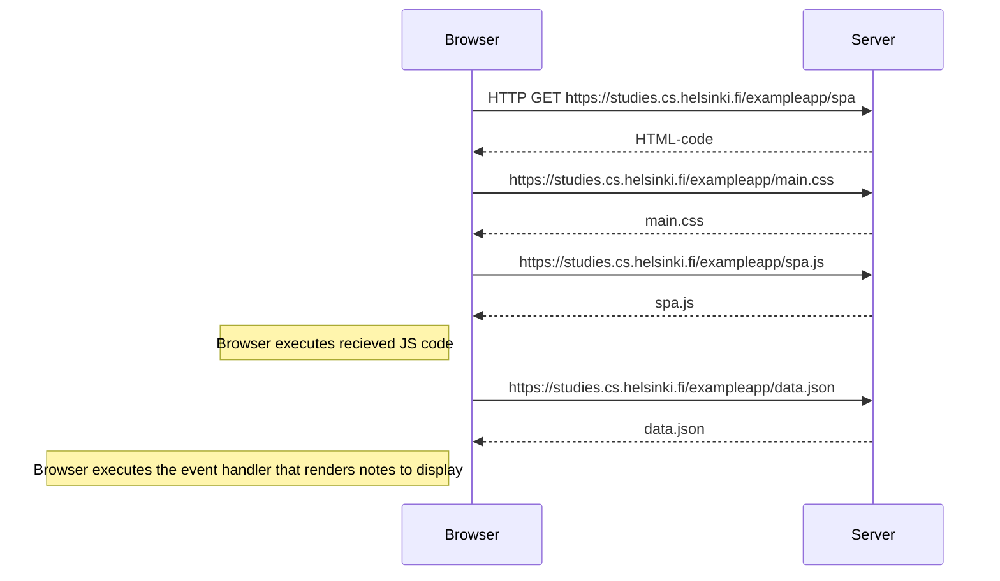

```mermaid
  sequenceDiagram
  Browser->>Server: HTTP GET https://studies.cs.helsinki.fi/exampleapp/spa;
  Server-->>Browser: HTML-code;
  Browser->>Server: https://studies.cs.helsinki.fi/exampleapp/main.css;
  Server-->>Browser: main.css;
  Browser->>Server: https://studies.cs.helsinki.fi/exampleapp/spa.js;
  Server-->>Browser: spa.js;
  note left of Browser: Browser executes recieved JS code;
  Browser->>Server: https://studies.cs.helsinki.fi/exampleapp/data.json;
  Server-->>Browser: data.json;
  note left of Browser: Browser executes the event handler that renders notes to display;
```
