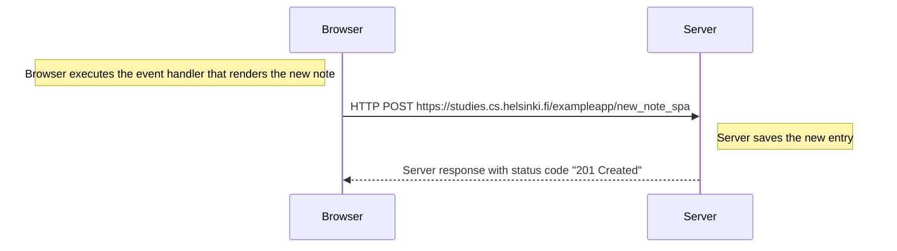

```mermaid
  sequenceDiagram
  note left of Browser: Browser executes the event handler that renders the new note;
  Browser->>Server: HTTP POST https://studies.cs.helsinki.fi/exampleapp/new_note_spa;
  note right of Server: Server saves the new entry;
  Server-->>Browser: Server response with status code "201 Created";
```
